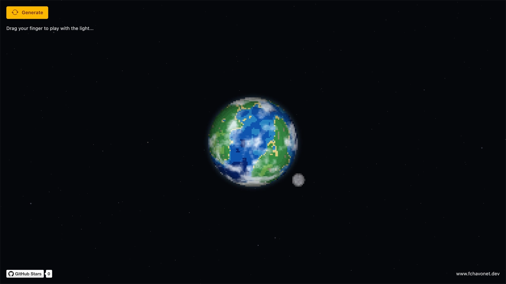
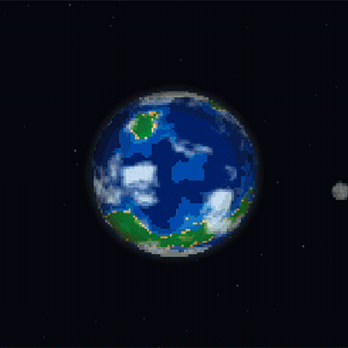

# Pixel Art Planet Generator

## Description

Pixel Art Planet Generator is an interactive experiment that procedurally generates animated celestial objects directly in the browser.

The project creates nine distinct types of pixel art planets, including habitable, desert, volcanic, frozen, gaseous, oceanic, rocky, hostile, and anomalous worlds. Each object is assembled from procedural textures, limited color palettes, discrete lighting levels, atmospheric effects, cloud layers, rings, and up to three orbiting moons.

Rare generations can also produce animated stars with luminous coronas or black holes surrounded by accretion disks.

The experience is rendered entirely with the Canvas 2D API. Moving the mouse or dragging a finger changes the light direction in real time, while each generated object continues to rotate independently against an animated starfield.

This project was created as a study of procedural generation, pixel art rendering, animation, depth, and interactive lighting using standard web technologies.

## Objectives

- Generate varied pixel art planets from procedural noise and predefined color palettes.
- Give each planet type a recognizable visual identity.
- Preserve a deliberately pixelated aesthetic through discrete lighting levels.
- Experiment with animated surfaces, clouds, atmospheres, rings, moons, stars, and black holes.
- Implement coherent depth and occlusion between planets, rings, and orbiting moons.
- Provide mouse, keyboard, and touch interactions in a minimal interface.
- Keep visual parameters editable through a local JSON configuration file.

## Tech Stack


## File Description

| **FILE**       | **DESCRIPTION**                                                                 |
| :------------: | ------------------------------------------------------------------------------- |
| `assets`       | Contains the resources required for the repository.                             |
| `index.html`   | Main HTML structure, DaisyUI components, and Tailwind CSS utility classes.      |
| `script.js`    | Procedural generation, Canvas 2D rendering, animation, depth, and interactions. |
| `planets.json` | Planet types, color palettes, lighting, rings, moons, and generation settings.  |
| `LICENSE`      | Proprietary license and usage restrictions for the project.                     |
| `README.md`    | The README file you are currently reading 😉.                                   |

## Installation & Usage

### Installation

1. Clone this repository:
    - Open your preferred Terminal.
    - Navigate to the directory where you want to clone the repository.
    - Run the following command:

```
git clone https://github.com/fchavonet/creative_coding-pixal_art_planet_generator.git
```

2. Open the cloned repository.

3. Start a local web server from the project directory:

```
python3 -m http.server 8000
```

4. Open [http://localhost:8000](http://localhost:8000) in your web browser.

> The project must be served through HTTP because `planets.json` is loaded with the Fetch API. Opening `index.html` directly from the file system may prevent the configuration file from loading.

### Usage

1. Click the `Generate` button or press the `Space` key to create a new celestial object.

2. Move your mouse around the sc reen to change the light direction.

> On a touchscreen, drag your finger across the scene to control the light.

You can also test the project online by clicking [here](https://fchavonet.github.io/creative_coding-pixal_art_planet_generator/).





## What's Next?

- Continue refining the procedural textures and visual identity of each planet type.
- Explore additional celestial objects and rare generation variants.
- Reuse the generator as the visual foundation for a future space exploration game.
- Add optional image, animation, or sprite sheet export tools.

## Thanks

- The visual direction was inspired by [Pixel Planet ](https://deep-fold.itch.io/pixel-planet-generator) by [Deep-Fold](https://github.com/Deep-Fold). This project is an independent Canvas 2D implementation created with web technologies.
- A big thank you to my friends Pierre and Yoann, always available to test and provide feedback on my projects.

## License

Copyright © 2026 - Fabien Chavonet. All rights reserved.

This repository is publicly accessible for viewing and educational reference only. No permission is granted to use, copy, modify, reproduce, distribute, sublicense, sell, or incorporate this project or any portion of its source code into another project without prior written authorization from the copyright holder.

See the LICENSE file for the complete terms.

## Author(s)

**Fabien CHAVONET**
- GitHub: [@fchavonet](https://github.com/fchavonet)
